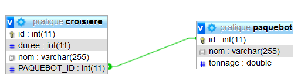

# 9 - @ManyToOne (corrigé) : ASSOCIATION UNIDIRECTIONNELLE DE N VERS 1 (**croisiere01**)

TRAVAIL A REALISER :

- mettre en place une association unidirectionnelle de plusieurs vers un entre **Croisiere** et **Paquebot**.

>Une croisère a forcément un Paquebot et un Paquebot peut être associé à plusieurs Croisières.

- Créer le projet **croisiere01**
- créer les classes **Paquebot** et **Croisiere**

La classe **Paquebot** comportera les attributs suivants :

```java
    private int id;
    private String nom;
    private double tonnage;
```

La clé primaire id sera autogénérée.

La classe **Croisiere** comportera les attributs suivants :

```java
    private int id;
    private String nom;
    private int duree;
    private Paquebot paquebot;
```

La clé primaire id sera autogénérée.

## Mise en place de l’association unidirectionnelle de plusieurs vers un

La navigabilité de l’association est de Croisiere vers Paquebot.

L’annotation **@ManyToOne** sur la méthode **getPaquebot()** ou sur l'attribut (au choix) de Croisière indique la navigabilité de Croisière vers Paquebot.

```java
    @ManyToOne(fetch=FetchType.EAGER)
    @JoinColumn(name="PAQUEBOT_ID")
    public Paquebot getPaquebot() {
        return paquebot;
    }
```

L’absence d’attribut *croisiere* dans la classe *Paquebot* indique le caractère unidirectionnel de l’association.

La présence de l’annotation **fetch=FetchType.EAGER** dans le **@ManyToOne** permet de faire en sorte que l’objet *Paquebot* puisse être disponible depuis *croisière* dès l'instanciation.
Cette propriété est davantage utilisée pour les Collections et permet un chargement automatique.

Voici le code à insérer dans votre contrôleur pour remplir la base de données et générer les tables dans MySQL :

```java
@RestController
@CrossOrigin("*")
public class CroisiereController {

	@Autowired
	private CroisiereRepository croisiereRepo;

	@Autowired
	private PaquebotRepository paquebotRepo;


	@GetMapping("/accueil")
	@ResponseBody
	public String home()
	{
		init();
		StringBuilder sb = new StringBuilder();
		sb.append("<h1>Regardez dans votre base de données MySQL <strong>JPA</strong></h1>");
		sb.append("<p>Vous devez avoir 2 tables dans votre base de données :</p>");
		sb.append("<ul><li><a href='http://localhost:8080/croisieres'>Liste des croisières enregistrées</a></li>");
		sb.append("<li><a href='http://localhost:8080/paquebots'>Liste des paquebots enregistrés</a></li></ul>");
		return  sb.toString();
	}

	@GetMapping("/croisieres")
	public ResponseEntity<?> getAllCroisieres(){
		List<Croisiere> liste = null;
		try
		{
			liste = croisiereRepo.findAll();
		} catch (Exception e) {
			return ResponseEntity.status(HttpStatus.NOT_FOUND).body(null);
		}

		return ResponseEntity.status(HttpStatus.OK).body(liste);
	}

	@GetMapping("/paquebots")
	public ResponseEntity<?> getAllPaquebots(){
		List<Paquebot> liste = null;
		try
		{
			liste = paquebotRepo.findAll();
		} catch (Exception e) {
			return ResponseEntity.status(HttpStatus.NOT_FOUND).body(null);
		}

		return ResponseEntity.status(HttpStatus.OK).body(liste);
	}

	/**
	 * Méthode d'initialisation (démo)
	 */
	private void init()
	{
		Paquebot p1 = new Paquebot("Queen Mary III", 50000);
		p1 = paquebotRepo.save(p1);

		Paquebot p2 = new Paquebot("Goeland ", 25000);
		p2 = paquebotRepo.save(p2);

		Croisiere c1 = new Croisiere("Mer Egée", 15);
		Croisiere c2 = new Croisiere("Mer Caspienne", 7);
		Croisiere c3 = new Croisiere("Adriatique", 8);
		c1.setPaquebot(p1);
		c2.setPaquebot(p1);
		c3.setPaquebot(p2);

		croisiereRepo.save(c1);
		croisiereRepo.save(c2);
		croisiereRepo.save(c3);

		//Modification de la durée (moins 2 jours) de la croisière Adriatique
		Croisiere croisiere = croisiereRepo.findByNom("Adriatique");
		if (croisiere != null) {
			croisiere.setDuree(croisiere.getDuree() - 2);
			croisiereRepo.saveAndFlush(croisiere);
		}

	}

}
```

Testez !

Voici le graphique (EER) de la BD :



[Retour vers les exercices](https://pbouget.github.io/cours/framework-back/1-jpa-orm/mapping-orm.html)

[Retour vers le cours complet](https://pbouget.github.io/cours/)